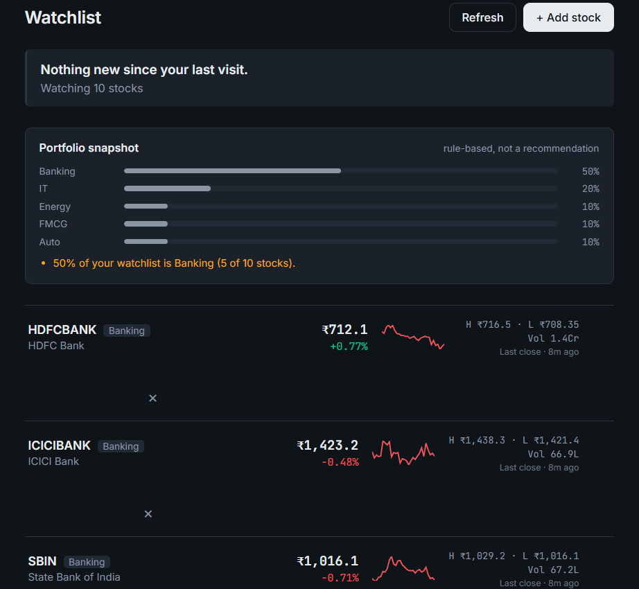
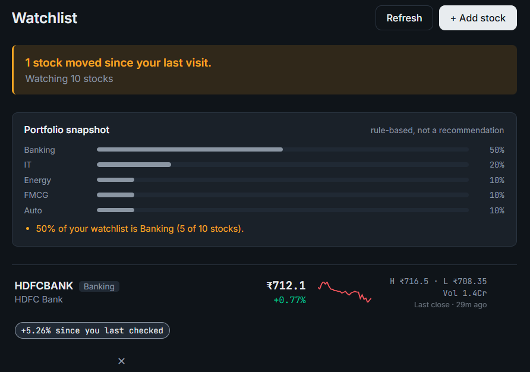
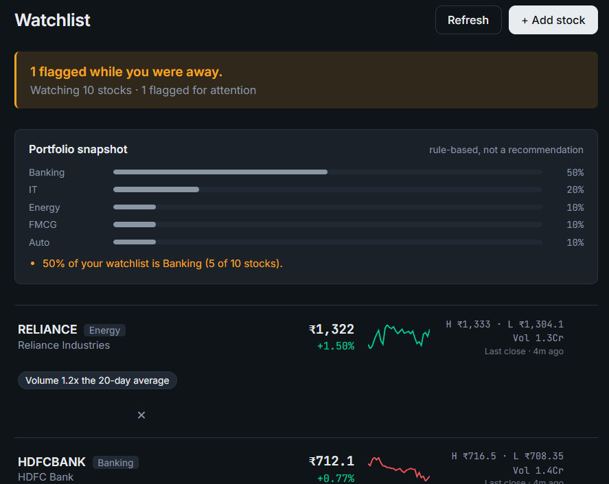
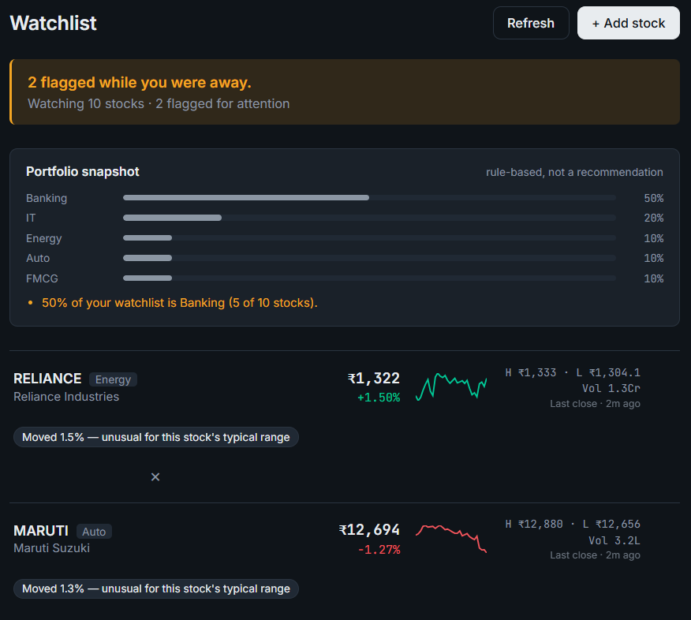
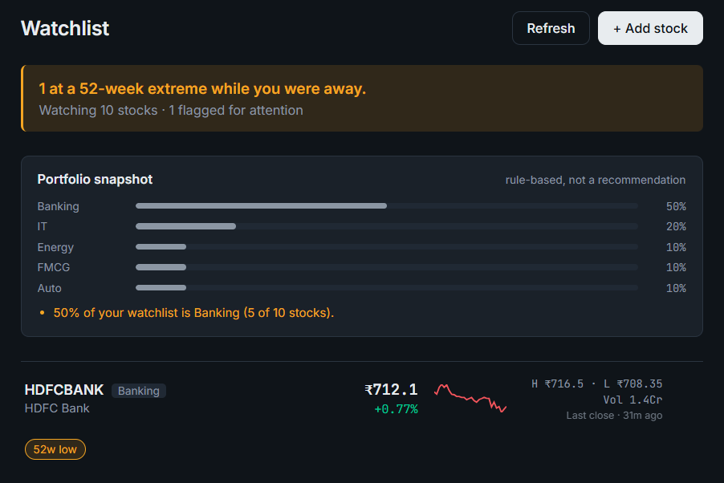
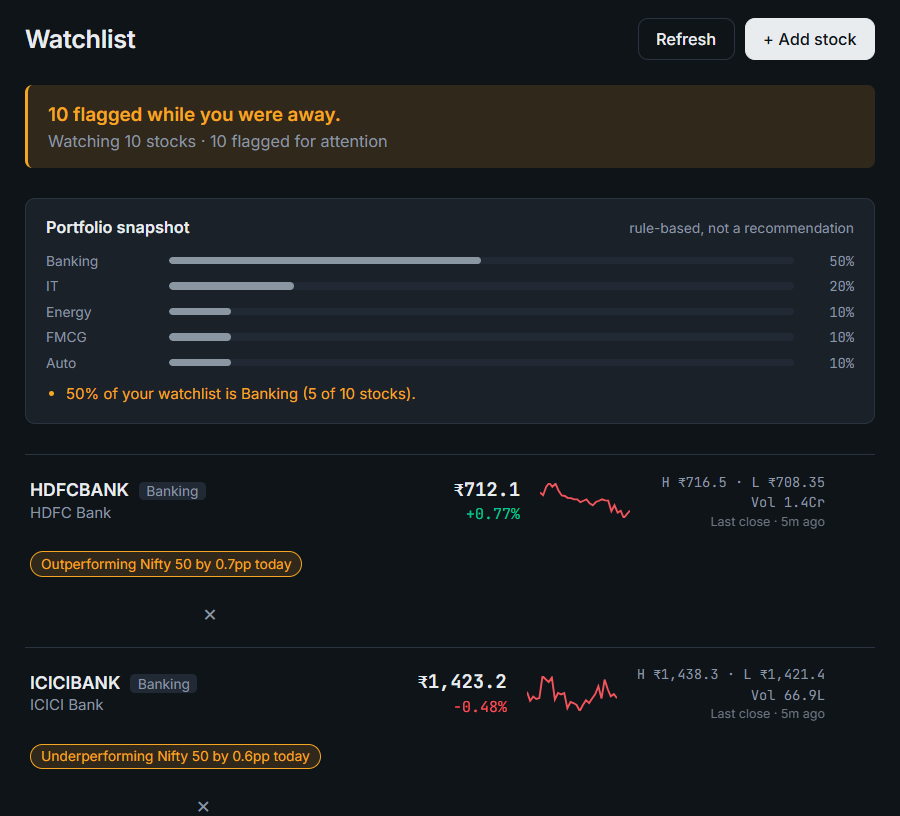
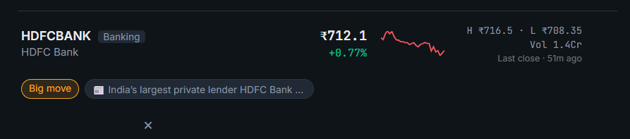
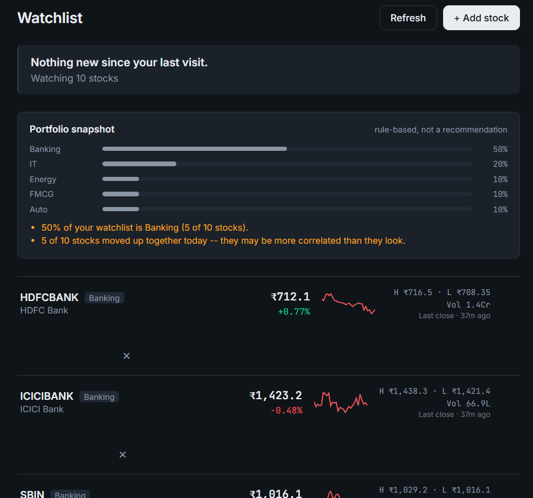
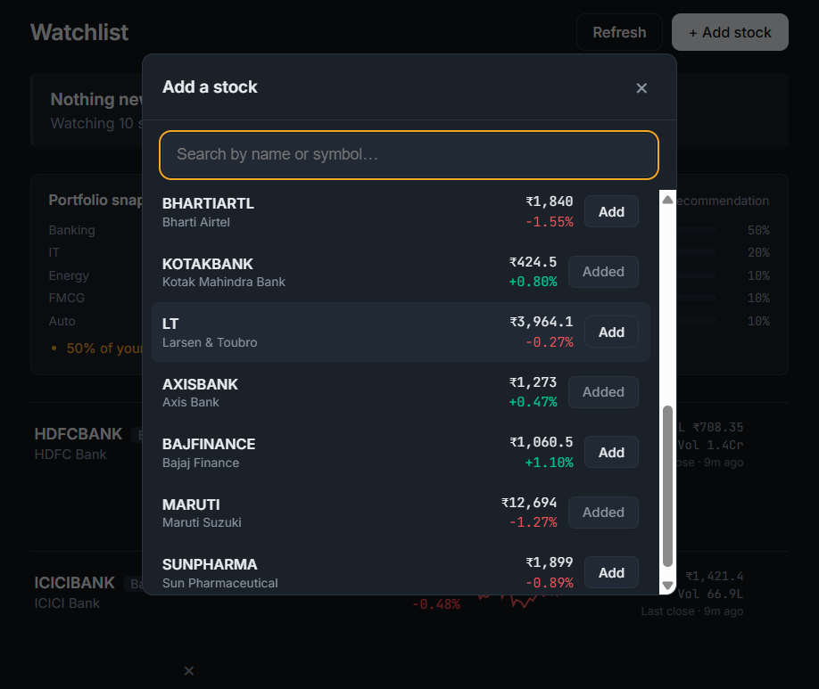

# Smart Watchlist

A watchlist that doesn't just show you stock prices, it remembers what you
saw last time, tells you what actually changed, and ranks what deserves your
attention right now.

**Live Demo:** https://smart-watchlist-by-samiksha.vercel.app

(Note: The backend runs on a free hosting tier that sleeps after periods of
inactivity. If the app feels stuck or slow on your first click, give it
30-50 seconds to wake up, that's expected, not a bug.)

## Screenshots

**Full watchlist - live prices, sparklines, and a quiet "nothing new" state**

**Core feature: remembers what you saw last time, tells you what changed**

**Volume spike detection - flags unusual trading activity**

**Volatility-relative flagging - catches a move that's small in absolute terms but unusual for that specific stock**

**52-week high/low detection**

**Benchmark comparison - flags stocks moving differently from the Nifty 50**

**Automatic news headline for a flagged stock - answers "why did this move?"**

**Portfolio snapshot - sector concentration and correlation, without giving investment advice**

**Add-stock search with live prices, not just names**

## The problem with a normal watchlist

Every broker app shows you: symbol, price, today's % change. That's it. You
have to *remember* what a stock was doing yesterday to know if something
meaningful happened. Most people don't, so they either miss real signals or
waste time re-scanning every row on every visit. Or worse, stop paying attention to it because it's too much work.

## What this does differently

Every time you open your watchlist, the backend compares "what you're seeing
now" against "what you saw the last time you looked"— per stock, per user—
and surfaces only what's worth noticing: a price move well outside a stock's
normal range, a fresh 52-week high, an unusual volume spike, a move that
diverges from the broader market. The watchlist is then **sorted by how much
attention each stock deserves**, not by the order you added them.

## Architecture

**Backend:** Python + FastAPI
**Data:** SQLite (three tables, see below)
**Market data:** yfinance (Yahoo Finance), NSE tickers via `.NS` suffix
**Frontend:** React + Vite, no UI framework— hand-built dark ledger design
**Identity:** an anonymous per-device UUID (see "State & identity" below)

### The three tables that make the core feature work

\`\`\`
watchlist_items   -> which symbols a device is watching
price_cache       -> ONE row per symbol, shared across every device
last_seen         -> ONE row per (device, symbol): what that device saw
                     the last time it loaded its watchlist
news_cache        -> cached headline per symbol, only populated for
                     flagged stocks
\`\`\`

\`price_cache\` being keyed by **symbol only** (not by user) is the whole
scaling story: 1,000 devices watching RELIANCE means one upstream API call,
not 1,000. \`last_seen\` is what makes "what changed since you looked" possible
at all— every watchlist load diffs current state against it, then
overwrites it with the current values, so the next visit diffs against *this*
one.

## What counts as a "meaningful change" (and why)

These are judgment calls the brief explicitly asks us to own:

| Signal | Threshold | Why |
|---|---|---|
| Big move | ±3% same-day | Catches large, liquid stocks moving hard |
| Unusual-for-this-stock | move ≥ 2× the stock's own 90-day daily volatility | A 2% move means something different for a sleepy FMCG stock than for a volatile smallcap— one fixed threshold can't capture that |
| 52-week high/low | price at or beyond the 1-year extreme | High-signal, cheap to compute |
| Volume spike | today's volume ≥ 2× the 20-day average | Often more predictive than price alone |
| Gap | open vs. previous close ≥ ±2% | Flags overnight/pre-market reactions |
| vs. Nifty 50 | stock's day change diverges from the index by ≥ 2 percentage points | A stock up 1% is unremarkable— unless the whole market is down 2% that day |

Each stock's flags are combined into an **attention score** (severity-weighted),
and the watchlist is sorted by that score— the most "interesting" stock is
always at the top.

## Handling stale, delayed, and conflicting data

- Every price shown carries a \`data_as_of\` timestamp and a \`Live\` / \`Last close\`
  label, so staleness is never hidden.
- Read-through cache with two TTLs: 15s while the market's open, up to 1hr
  while closed (no reason to hit the API for a price that can't change until
  9:15am).
- If the upstream fetch genuinely fails, the last known cached value is served
  with an explicit \`delayed\` flag— the app degrades gracefully instead of
  breaking.
- Source of truth precedence: live fetch > cached value > nothing. We don't
  attempt multi-source reconciliation (e.g. NSE feed vs. a second provider)—
  not necessary at this scale.

## State persistence across sessions

No login for this build, instead, a random device ID is generated on first
visit and stored client-side, sent with every request. The backend keys
\`watchlist_items\` and \`last_seen\` off this ID, so a device's watchlist and
"last seen" memory survive closing the tab, restarting the browser, or
coming back the next day. It does **not** currently sync across different
devices— swapping in real auth (e.g. Supabase/JWT) later only changes how
the ID is obtained, not how anything downstream uses it.

## Additional features

- **Portfolio snapshot**: rule-based sector concentration + directional
  alignment across the watchlist. Deliberately descriptive, not prescriptive— it never recommends what to buy, since that edges into investment advice
  for a SEBI-regulated brokerage's product. This is also the intentionally
  buildable stand-in for the ML-based recommendation engine described below.
- **Sparklines**: 30-day trend per stock, reusing data already fetched for
  the 52-week calculation.
- **News headlines**: only fetched for stocks that already triggered a
  big-move or gap flag (not every stock, every request), via Google News'
  public RSS search— no API key required. This is an unofficial-but-public
  feed, fine for a demo; swapping in a formal news API later touches one
  function.

## Deliberately out of scope (and why)

- **ML-based personalized recommendations** : the original idea behind the
  portfolio snapshot feature. Needs training data, and "what should I buy" edges into investment-advice territory
  for a regulated brokerage regardless. The rule-based version above is the
  honest, buildable version of the same instinct.
- **Real authentication** : device-ID identity was a deliberate speed
  tradeoff; swapping it for real auth is a contained change.
- **Full NSE/BSE universe** : scoped to Nifty 50 to keep search fast and the
  demo finite.
- **Market holiday calendar** : \`is_market_open()\` checks weekday + hours
  only.
- **Push notifications when the app is closed** : needs a background worker;
  out of scope for the timebox.

## Running it

### Quick option: live demo
Visit https://smart-watchlist-by-samiksha.vercel.app - no setup needed.
(Same free-tier sleep note as above applies.)

### Running it locally

### Backend
\`\`\`
cd backend
python -m venv venv
venv\\Scripts\\activate.bat      # Windows
pip install -r requirements.txt
uvicorn main:app --reload --port 8000
\`\`\`

### Frontend
\`\`\`
cd frontend
npm install
npm run dev
\`\`\`

Open \`http://localhost:5173\`. Backend must be running on port 8000.